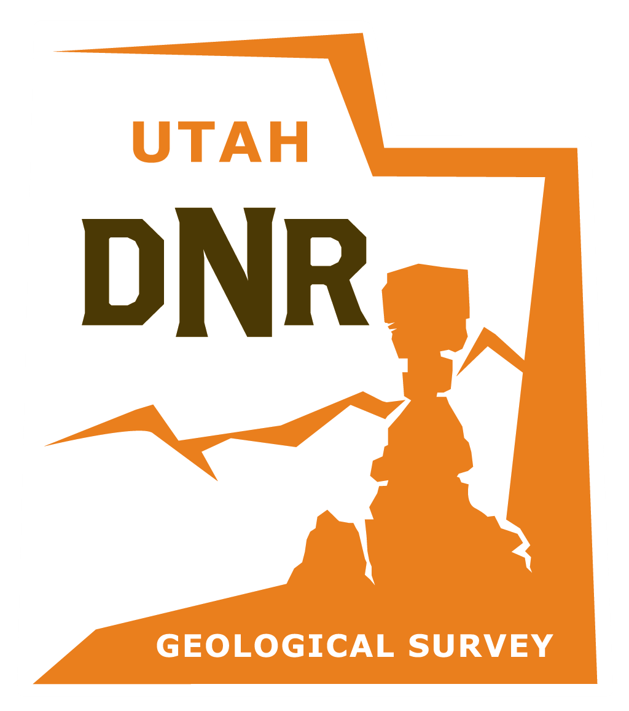

# Geological Hazards Portal v2
ankgalkdgnadklgsdffghadshgmnal;
<p align="center">
  
</p>

The UGS Geological Hazards Portal v2 crafted with @arcgis/core, Shadcn and Vite. Built with responsiveness and accessibility in mind.

## Features
test
- Light/dark mode
- Responsive
- Accessible
- Sidebar and header layouts
- Dynamic Layerlist

## Tech Stack

**UI:** [ShadcnUI](https://ui.shadcn.com) (TailwindCSS + RadixUI)

**Mapping** [ArcGIS JS SDK](https://developers.arcgis.com/javascript/latest/)

**Build Tool:** [Vite](https://vitejs.dev/)

**Routing:** [React Router](https://reactrouter.com/en/main)

**Type Checking:** [TypeScript](https://www.typescriptlang.org/)

**Linting/Formatting:** [Eslint](https://eslint.org/) & [Prettier](https://prettier.io/)

**Icons:** [Lucide React Icons](https://lucide.dev/icons/)

## Run Locally

Clone the project

```bash
  git clone https://github.com/UGS-GIO/geohaz-v2.git
```

Go to the project directory

```bash
  cd geohaz-v2
```

Install dependencies

```bash
  npm install
```

Start the server

```bash
  npm run dev
```

## Author

Crafted with 🤍 by the [Utah Geological Survey](https://github.com/UGS-GIO/)

## License

Licensed under the [MIT License](https://choosealicense.com/licenses/mit/)
